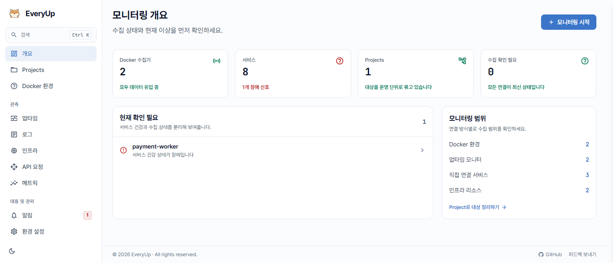

<p align="center">
  
</p>

<h1 align="center">EveryUp</h1>

<p align="center">
  A self-hosted monitoring dashboard with a lightweight Docker Collector.
</p>

<p align="center">
  <a href="https://ai-turn.github.io/everyup/en/"><b>Docs</b></a> -
  <a href="https://ai-turn.github.io/everyup/demo/"><b>Live Demo</b></a> -
  <a href="README.md">한국어</a>
</p>

<p align="center">
  <a href="https://ai-turn.github.io/everyup/en/"></a>
  <a href="https://ai-turn.github.io/everyup/demo/"></a>
  
  
  
  
</p>

<p align="center">
  
</p>

> **Note:** the dashboard interface is Korean only.

EveryUp is a self-hosted tool for monitoring your Docker services in one place.
Run **Web** once on a dashboard server, then connect each **Docker environment**
with the lightweight EveryUp Docker Collector.

| Part | What it does | Where it runs |
| --- | --- | --- |
| **Web** | Dashboard, users, alert rules, notification channels, history | Your dashboard server |
| **Docker Collector** | Docker discovery, container state, logs, host metrics | Each Docker host you monitor |

## Quick Start

```bash
docker run -d --name everyup -p 3001:3001 -v everyup-data:/app/data --restart unless-stopped aiturn/everyup:latest
```

Open `http://WEB_SERVER_IP:3001`, create the first admin account, then install
the Collector from **Connect Docker** in the dashboard. For the Compose setup and
Collector installation, see the
[Quick Start docs](https://ai-turn.github.io/everyup/en/guide/quickstart).

## Documentation

| Page | What's inside |
| --- | --- |
| [Introduction](https://ai-turn.github.io/everyup/en/guide/introduction) | Features and what gets collected |
| [Quick Start](https://ai-turn.github.io/everyup/en/guide/quickstart) | Start Web, connect Docker, install the monitoring bundle |
| [Automatic eBPF Observer](https://ai-turn.github.io/everyup/en/guide/ebpf-observer) | API latency and traces with no app changes |
| [Headers & bodies](https://ai-turn.github.io/everyup/en/guide/otel-instrumentation) | Request/response headers and bodies via OpenTelemetry |
| [Notification channels](https://ai-turn.github.io/everyup/en/guide/notifications) | Telegram / Discord / Slack setup |
| [Backup](https://ai-turn.github.io/everyup/en/guide/backup-restore) · [Troubleshooting](https://ai-turn.github.io/everyup/en/guide/troubleshooting) | Operations |
| [Web configuration](https://ai-turn.github.io/everyup/en/reference/web) · [Docker Collector configuration](https://ai-turn.github.io/everyup/en/reference/collector) | Environment variable and networking reference |

## Development

```text
web/
  backend/                 # Go 1.24 API server, SQLite migrations, OTLP ingest
  frontend/                # React 19 / Vite dashboard
agent/                     # Docker Collector (Go 1.25)
docs/                      # Docs site (VitePress) — ai-turn.github.io/everyup
```

Prerequisites for source development: Docker, pnpm, Go 1.24 for Web, and Go
1.25 for the Docker Collector.

```bash
cd web/backend && go test ./...     # backend tests
cd web/frontend && pnpm build       # frontend build
cd agent && go test ./...           # Docker Collector tests
pnpm docs:dev                       # run the docs site locally
```

Running each part locally is covered in [web/README.md](web/README.md) and
[agent/README.md](agent/README.md); the instrumentation E2E fixture is in
[e2e/monitoring-target](e2e/monitoring-target/README.md).
