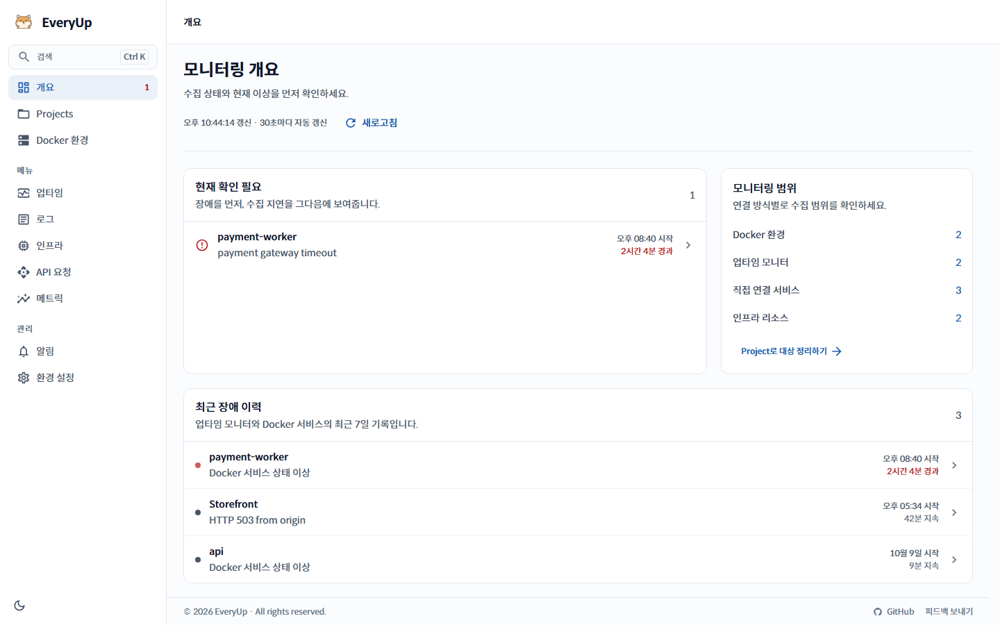

<p align="center">
  
</p>

<h1 align="center">EveryUp</h1>

<p align="center">
  Docker 서비스를 위한 셀프호스팅 모니터링 대시보드와 가벼운 Docker Collector.
</p>

<p align="center">
  <a href="https://ai-turn.github.io/everyup/"><b>문서</b></a> -
  <a href="https://ai-turn.github.io/everyup/demo/"><b>Live Demo</b></a> -
  <a href="README.en.md">English</a>
</p>

<p align="center">
  <a href="https://ai-turn.github.io/everyup/"></a>
  <a href="https://ai-turn.github.io/everyup/demo/"></a>
  
  
  
  
</p>

<p align="center">
  
</p>

EveryUp은 Docker로 실행 중인 서비스를 한곳에서 모니터링하는 셀프호스팅 도구입니다.
대시보드 서버에 **Web**을 한 번 띄우고, 모니터링할 **Docker 환경**마다 가벼운
EveryUp Docker Collector를 실행하면 끝입니다.

| 구성 | 역할 | 실행 위치 |
| --- | --- | --- |
| **Web** | 대시보드, 사용자, 알림 규칙·채널, 히스토리 | 대시보드 서버 |
| **Docker Collector** | Docker 디스커버리, 컨테이너 상태, 로그, 호스트 메트릭 | 모니터링할 각 Docker 호스트 |

## 빠른 시작

```bash
docker run -d --name everyup -p 3001:3001 -v everyup-data:/app/data --restart unless-stopped aiturn/everyup:latest
```

`http://WEB_SERVER_IP:3001`에서 첫 관리자 계정을 만든 뒤, 대시보드의 **Docker 연결**로
Collector를 설치합니다. Compose 구성과 Collector 설치는
[빠른 시작 문서](https://ai-turn.github.io/everyup/guide/quickstart)를 참고하세요.

## 문서

| 문서 | 내용 |
| --- | --- |
| [소개](https://ai-turn.github.io/everyup/guide/introduction) | 핵심 기능과 수집되는 데이터 |
| [빠른 시작](https://ai-turn.github.io/everyup/guide/quickstart) | Web 실행, Docker 연결, 모니터링 번들 설치 |
| [자동 eBPF Observer](https://ai-turn.github.io/everyup/guide/ebpf-observer) | 앱 수정 없이 API latency·trace 수집 |
| [헤더·바디 상세 수집](https://ai-turn.github.io/everyup/guide/otel-instrumentation) | OpenTelemetry로 요청/응답 헤더·바디 수집 |
| [알림 채널](https://ai-turn.github.io/everyup/guide/notifications) | Telegram / Discord / Slack 설정 |
| [백업·복원](https://ai-turn.github.io/everyup/guide/backup-restore) · [트러블슈팅](https://ai-turn.github.io/everyup/guide/troubleshooting) | 운영 |

## 개발

```text
web/
  backend/                 # Go 1.24 API 서버, SQLite migration, OTLP ingest
  frontend/                # React 19 / Vite 대시보드
agent/                     # Docker Collector (Go 1.25), 설정 레퍼런스는 agent/README.md
docs/                      # 문서 사이트 (VitePress) — ai-turn.github.io/everyup
```

소스 개발 사전 요구사항: Docker, pnpm, Web용 Go 1.24, Docker Collector용 Go 1.25.

```bash
cd web/backend && go test ./...     # 백엔드 테스트
cd web/frontend && pnpm build       # 프론트엔드 빌드
cd agent && go test ./...           # Docker Collector 테스트
pnpm docs:dev                       # 문서 사이트 로컬 실행
```

설정 레퍼런스는 [web/README.md](web/README.md)와 [agent/README.md](agent/README.md),
상세 수집 E2E fixture는 [e2e/monitoring-target](e2e/monitoring-target/README.ko.md)에 있습니다.
